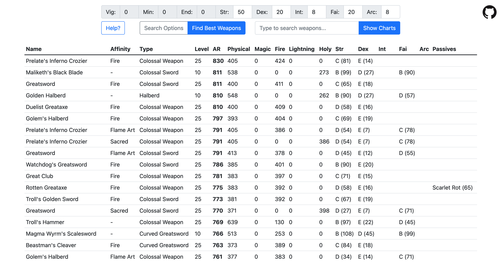
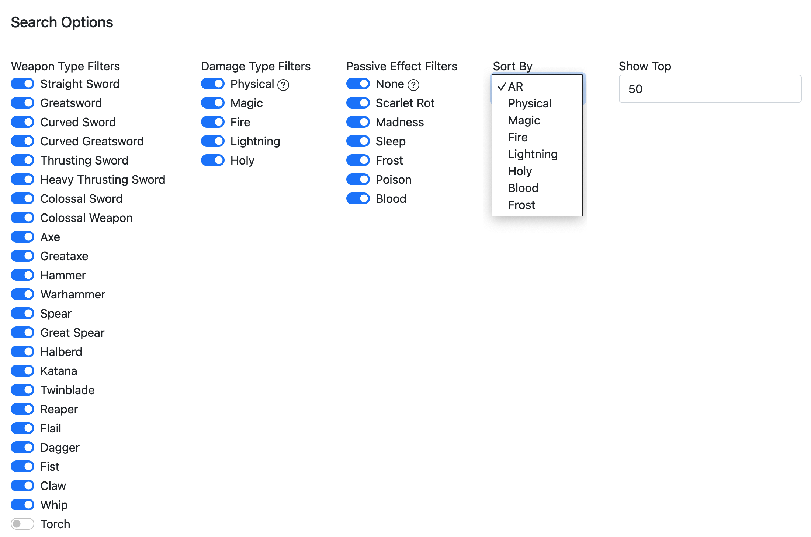
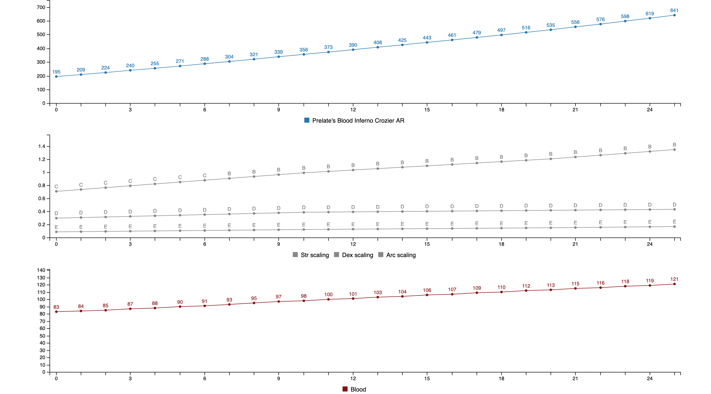

# Elden Ring Damage Calculator

Search for the best weapons for your build

Filter on weapon and damage types. Sort by AR, damage types, and passive effects

See how the weapon's stats change as you upgrade it

You can now see how the weapon's stats change with attributes in real time using the slider under the charts

## Updates

2022/04/16 - Fixed damage calculations when stats don't meet weapon requirements

2022/04/15 - Added ability to exclude split damage weapons in damage type filter

2022/04/14 - Fixed incorrect non-strength scaling values on all +0 weapons. UI updates

2022/04/13 - Added weapon comparison charts

2022/04/11 - Added 'Spell Boost' (Incantaion/Sorcery scaling) calculations, and added it as a sort option

## Usage

Enter your attributes at the top, then either search for the best weapon for your stats, or look up a specific weapon and see how it will perform.

You can customize the search results by clicking `Search Options`. If you click on a weapon in the results table it will show you the graphs for that weapon.

The graphs show how different weapon stats vary with upgrade level:
- Total AR
- Attribute scaling
- Passive effects

## Credits

All data and calculations are from the spreadsheet by u/TarnishedSpreadsheet [here's the reddit post with all the updates and spinoff projects](https://www.reddit.com/r/Eldenring/comments/tbco46/elden_ring_weapon_calculator/)

## Development

I'm clearly not a frontend developer, my JS and UX foo is weak. Suggestions / improvements / PRs welcome!

## ToDo
- Weapon details section/modal that shows all data about weapon (damage, guard, requirements, etc)
    - Level slider/select so user can choose what level to view.
